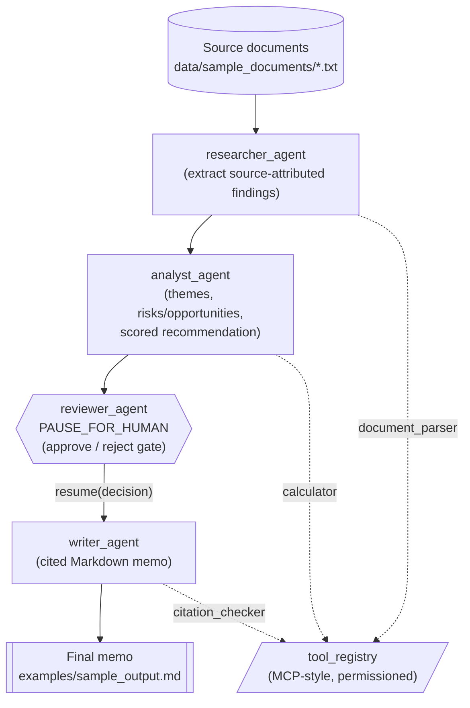
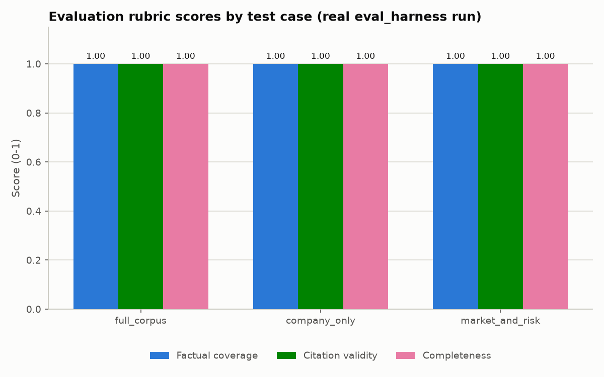
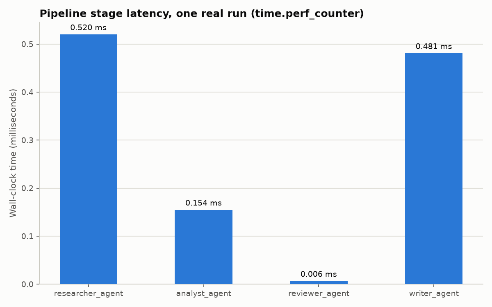

# Agentic Workflow Orchestrator

A multi-agent research-to-memo pipeline with a mandatory human-in-the-loop
review gate and a pluggable, permissioned tool interface. Source documents
go in; a researcher agent extracts source-attributed findings; an analyst
agent synthesizes themes, risk/opportunity signals, and a scored
recommendation; a reviewer gate holds the draft for approval; and a writer
agent produces a structured Markdown memo where every claim carries an
inline citation that has been mechanically checked against its source. The
whole thing runs on a small DAG-based orchestration engine, and a
rubric-based evaluation harness scores pipeline output quality end to end.
Every part of the shipped demo runs fully offline, with clearly-labeled
deterministic stand-ins for the LLM calls a production deployment would
make.

## Why this matters for professional-services firms

Professional services such as advisory work is fundamentally document-and-research-heavy: due diligence,
market research, regulatory research, and client memos all start from a
pile of source material that has to be read, synthesized, and turned into
a defensible, cited written product. A well-governed multi-agent pipeline
can compress the first-draft research and synthesis cycle -- while keeping
a mandatory human review gate before anything reaches a client, and a
tool-permission model that prevents an agent from taking actions (e.g.
calling arbitrary external systems) beyond its intended scope. That
combination -- speed on the first draft, explicit approval gates, and a
narrow, auditable action surface per agent -- is directly relevant to firms
exploring AI-enabled service delivery without giving up control or quality.
Two things in this repository are worth borrowing wholesale into other
projects even if the "research memo" use case does not fit: the
permissioned tool-registry pattern, and the pause/resume human-in-the-loop
mechanic.

## Architecture



See `docs/architecture.md` for a detailed walkthrough of this diagram,
including exactly how the pause/resume mechanic and the tool permission
grants work.

## What's inside

| Module | Purpose |
|---|---|
| `src/orchestrator/agent_base.py` | Abstract `Agent` base class: name, system prompt, tool allow-list, memory, and the `llm_client` production seam. |
| `src/orchestrator/agents/researcher_agent.py` | Parses source documents and extracts structured, source-attributed findings. |
| `src/orchestrator/agents/analyst_agent.py` | Synthesizes findings into themes, risk/opportunity signals, and a scored recommendation. |
| `src/orchestrator/agents/reviewer_agent.py` | **Human-in-the-loop gate.** Runs a quality checklist and records an approve/reject decision. |
| `src/orchestrator/agents/writer_agent.py` | Renders approved analysis into a cited Markdown memo, validating every citation first. |
| `src/orchestrator/tool_registry.py` | **MCP-style tool registry with per-agent permission scopes.** Central, auditable choke point for every tool call. |
| `src/orchestrator/tools/` | `document_parser_tool`, `calculator_tool` (no raw `eval()`), `citation_checker_tool`. |
| `src/orchestrator/orchestration_graph.py` | **DAG workflow engine with a first-class `PAUSE_FOR_HUMAN` node type** and `resume()` mechanic. |
| `src/orchestrator/pipeline.py` | Shared wiring: builds the registry, agents, and graph used by both the example and the eval harness. |
| `src/orchestrator/eval/eval_harness.py` | Rubric-based evaluator: factual coverage, citation validity, completeness. |

The two most reusable design patterns here, independent of the specific
"research memo" use case, are:

1. **The MCP-style tool-registry / permission pattern** (`tool_registry.py`):
   tools register with a name, a JSON-schema-like input spec, and a
   handler; agents are granted an explicit allow-list; calling a tool
   outside that allow-list raises `ToolPermissionError`. This is a small,
   dependency-free illustration of the "AI service interface / gateway"
   patterns showing up across Anthropic tool use, OpenAI function calling,
   and the Model Context Protocol.
2. **The human-in-the-loop pause/resume mechanic** (`orchestration_graph.py`):
   a `PAUSE_FOR_HUMAN` node type that genuinely halts graph execution and
   returns a resumable `WorkflowState`; the caller supplies a decision
   out-of-band and calls `resume(state, decision)` to continue. This is the
   general mechanism for "stop and wait for a qualified human" in an
   otherwise-automated pipeline.

## Example output

Evaluation rubric scores (real `eval_harness.evaluate()` run against the
bundled labeled test set):



Pipeline stage latency (real `time.perf_counter()` measurements from one
end-to-end run):



Excerpt of `examples/sample_output.md`, generated by actually running
`examples/run_pipeline.py` against the bundled fictional sample documents:

```markdown
# Research & Analysis Memo

*Generated by an offline, deterministic demo pipeline. See the project README for how a production LLM would be plugged in.*

## Executive Summary

Recommendation: **Unfavorable** (net signal score -33.33 on a -100..+100 scale). Identified 5 opportunity signal(s) and 10 risk signal(s) across 3 theme(s); net signal score is -33.33 on a -100..+100 scale.

## Key Findings

- Northbridge Analytics is a fictional mid-market data-analytics software company founded in 2016 and headquartered in the fictional city of Rivermont. [company_notes#0]
- For its most recently completed fiscal year, Northbridge Analytics reported annual recurring revenue of 42 million dollars, up 28 percent year over year. [company_notes#1]
- The company serves 610 active customers, most of them mid-market software vendors in logistics, healthcare scheduling, and property management verticals. [company_notes#1]
- Headcount stands at 340 employees, with roughly 40 percent of staff in engineering and product roles. [company_notes#2]
```

`Northbridge Analytics` is an entirely fictional company invented for this
demo; see `data/sample_documents/` for the full (also fictional) source
material.

## Quickstart

```bash
git clone <this-repo-url>
cd agentic-workflow-orchestrator
python -m venv .venv
source .venv/bin/activate   # on Windows: .venv\Scripts\activate
pip install -r requirements.txt

pytest                                # run the full test suite
python examples/run_pipeline.py       # run the end-to-end demo pipeline
python scripts/generate_charts.py     # regenerate the charts in docs/images/
```

No network access or API key is required for any of the above -- the
entire pipeline runs against deterministic local stub logic.

## Plugging in a real LLM

Every agent's constructor accepts an optional `llm_client` callable:

```python
llm_client: Callable[[str, str], str] | None
```

called as `llm_client(system_prompt, user_prompt) -> completion_text`. When
`llm_client` is `None` (the default, and the path used throughout this
repository's tests and examples), each agent falls back to its
deterministic offline stub. To connect a real model, wrap your provider's
SDK in a function matching that signature and pass it in, for example
against the Anthropic Messages API:

```python
import anthropic
from orchestrator.agents.researcher_agent import ResearcherAgent
from orchestrator.tool_registry import ToolRegistry

client = anthropic.Anthropic()  # reads ANTHROPIC_API_KEY from the environment

def anthropic_llm_client(system_prompt: str, user_prompt: str) -> str:
    response = client.messages.create(
        model="claude-sonnet-4-5",
        max_tokens=2048,
        system=system_prompt,
        messages=[{"role": "user", "content": user_prompt}],
    )
    return "".join(block.text for block in response.content if block.type == "text")

registry = ToolRegistry()  # ... register tools and grant permissions as usual
researcher = ResearcherAgent(registry, llm_client=anthropic_llm_client)
```

The same pattern applies to `AnalystAgent` and `WriterAgent`. `ReviewerAgent`
is deliberately not LLM-backed -- see its module docstring for why the
human-in-the-loop gate is a policy decision, not a generation step. Note
that the current `act()` implementations raise `NotImplementedError` on the
LLM-backed code path as a documented extension point (prompting and
response-parsing are deployment-specific); the deterministic stub path is
what ships and is fully tested.

## Disclaimer

This repository is a reference / portfolio-grade implementation
demonstrating a multi-agent orchestration pattern -- with a permissioned
tool interface and a mandatory human-in-the-loop review gate -- for
AI-enabled research and analysis workflows in advisory and
professional-services settings. The included demo runs fully offline
against fictional sample documents using deterministic stand-ins for LLM
calls; it can be used as a deployable starting point by advisory or
consulting firms, but any real deployment must connect a production-grade
LLM, be evaluated against the firm's own quality and citation-accuracy bar,
and keep a qualified human reviewer in the loop before client delivery.
Outputs are not a substitute for professional advice.

## License

MIT. See [LICENSE](LICENSE).
