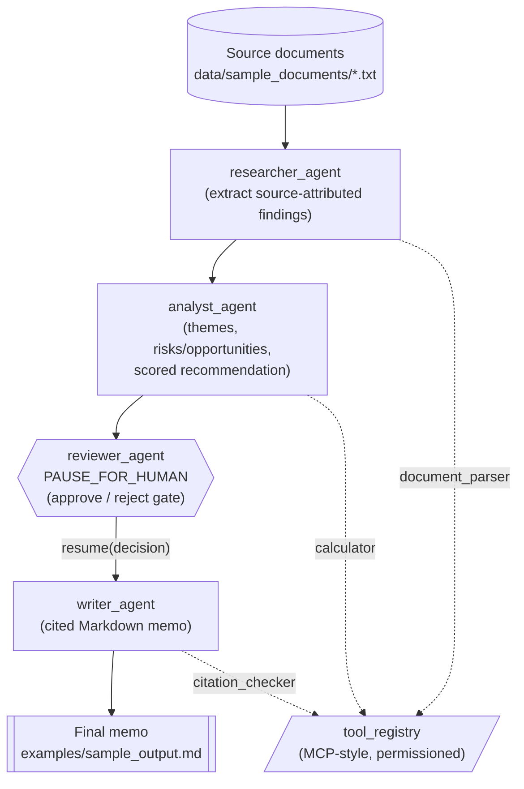

# Architecture

This document describes the shape of the pipeline implemented in
`src/orchestrator/`: a small DAG of agent steps, mediated by a permissioned
tool registry, with a mandatory human-in-the-loop review gate between
analysis and final writing.

## Agent DAG

## How to read this diagram

- **Solid arrows** are the orchestration graph's data-flow edges, executed
  in topological order by `OrchestrationGraph.run()` (see
  `src/orchestrator/orchestration_graph.py`).
- **`reviewer_agent` is a `PAUSE_FOR_HUMAN` node.** Execution genuinely
  halts there: `run()` returns a `WorkflowState` with `status == PAUSED`
  and `pending_node_id == "reviewer_agent"`. Nothing downstream (including
  `writer_agent`) executes until the caller supplies a decision via
  `OrchestrationGraph.resume(state, decision)`. In the offline demo, that
  decision comes from `ReviewerAgent`'s auto-approve checklist path; in
  production it would come from an actual reviewer's approve/reject input.
- **Dotted arrows** show each agent's calls through `tool_registry`, the
  MCP-style, permission-scoped tool gateway (see
  `src/orchestrator/tool_registry.py`). Every agent is constructed with an
  explicit `allowed_tools` list, and the registry enforces it:
  `researcher_agent` may only call `document_parser`, `analyst_agent` may
  only call `calculator`, `writer_agent` may only call `citation_checker`,
  and `reviewer_agent` is granted no tools at all. A call to any tool
  outside an agent's grant raises `ToolPermissionError` -- this is the
  concrete mechanism behind the "agent cannot exceed its intended scope"
  guarantee described in the README.

## Pipeline wiring

The DAG above is assembled once, in `src/orchestrator/pipeline.py::run_pipeline`,
and reused identically by:

- `examples/run_pipeline.py` -- the runnable end-to-end demo.
- `src/orchestrator/eval/eval_harness.py` -- the rubric-based evaluation
  harness, which runs the same pipeline against a labeled test set.

This keeps the example and the evaluation harness from drifting into two
subtly different pipelines.
